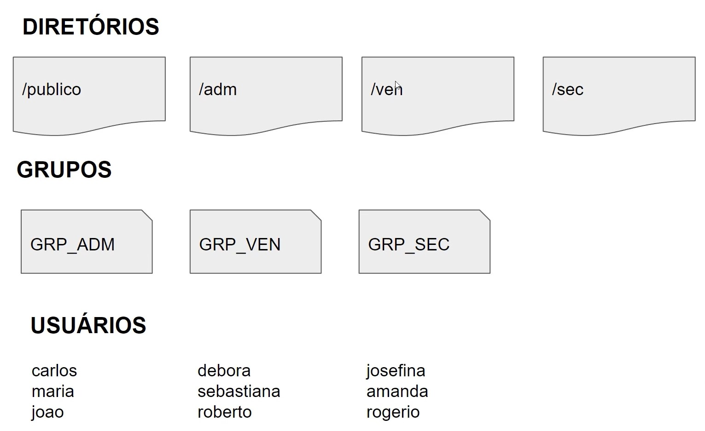

# Desafio Script no Linux usando Shell

### Este script é a solução para o desafio proposto pelo bootcamp da DIO.

**Objetivo:**

Criar um script em Shell que realize as seguintes tarefas:

1.  Criar os diretórios: `/publico`, `/adm`, `/ven` e `/sec`.
2.  Criar os grupos de usuário: `GRP_ADM`, `GRP_VEN` e `GRP_SEC`.
3.  Criar os usuários: `carlos`, `maria`, `joao`, `debora`, `sebastiana`, `roberto`, `josefina`, `amanda` e `rogerio`.
4.  Especificar as permissões dos diretórios:

    - `/publico`: Permissão total (777) para todos os usuários.
    - `/adm`: Permissão total (770) para o grupo `GRP_ADM` e permissão de leitura para o usuário root.
    - `/ven`: Permissão total (770) para o grupo `GRP_VEN` e permissão de leitura para o usuário root.
    - `/sec`: Permissão total (770) para o grupo `GRP_SEC` e permissão de leitura para o usuário root.

    

**Funcionalidade extra:**

O script força a troca de senha no primeiro acesso para todos os usuários criados, garantindo maior segurança.

**Como usar:**

1.  **Obtenha o script:**
    - Clone o repositório: `git clone git@github.com:GleristonCastro/Linux-IAC.git`
    - Ou baixe o arquivo `groups_permissions.sh` diretamente.
2.  **Dê permissão de execução:**
    ```shell
    chmod +x groups_permissions.sh
    ```
3.  **Execute o script:**
    ```shell
    ./groups_permissions.sh
    ```

**Importante:**

- **Faça backup do seu sistema antes de executar este script.** Ele modifica as permissões de arquivos e diretórios, e um backup garante que você possa restaurar o sistema em caso de erros ou problemas.
- Este script foi testado em ambientes Linux.
- Certifique-se de ter o `openssl` instalado para a geração de senhas criptografadas.

**Autor:**

Gleriston Castro

**Repositório:**

https://github.com/GleristonCastro/Linux-IAC
